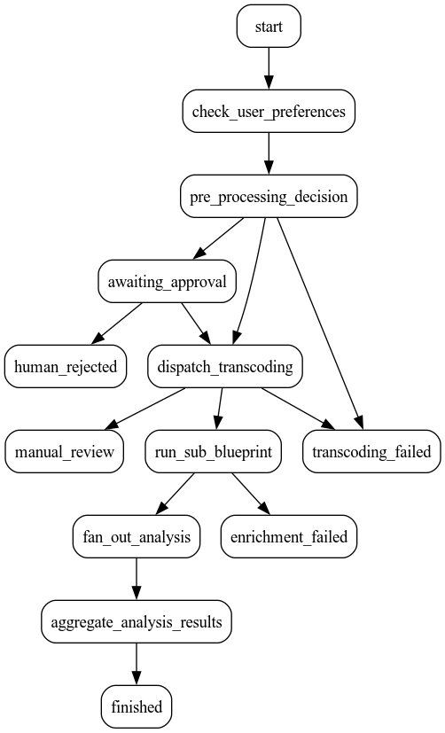
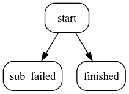

# Avtomatika: Демонстрационный проект (Full Showcase)

[EN](./README.md) | RU

Этот проект представляет собой комплексную демонстрацию возможностей экосистемы **Avtomatika HLN (Hierarchical Logic Network)**. Здесь собраны все ключевые архитектурные паттерны: от простых задач до вложенных процессов, параллельного выполнения и автоматического планирования.

## 🏗 Архитектура системы

Пример разворачивает полноценную распределенную среду:



1.  **Orchestrator**: Центральный узел, управляющий блупринтом `full_showcase`.
2.  **GPU Worker**: Высокопроизводительный воркер для "тяжелых" задач (транскодирование).
3.  **CPU Workers**: Два воркера для анализа файлов (один стабильный, другой — намеренно нестабильный для проверки репутации).

### 🪆 Логика подпроцессов
Дочерний блупринт `metadata_enrichment`:


4.  **Scheduler**: Встроенный планировщик, запускающий задачи обслуживания по расписанию.
5.  **Webhook Receiver**: Внешний сервис, принимающий уведомления о статусе задач в реальном времени.
6.  **Инфраструктура**: 
    *   **Redis**: Хранение состояний и очереди задач.
    *   **PostgreSQL**: Долгосрочная история и аудит.
    *   **MinIO (S3)**: Хранение тяжелых файлов (payload offloading).
    *   **VictoriaMetrics & Grafana**: Сбор метрик и визуализация производительности.
    *   **Jaeger**: Распределенная трассировка запросов (OpenTelemetry).

## 🌟 Ключевые возможности в этом примере

### 1. Нативный планировщик (Scheduler) ⏰
Оркестратор автоматически загружает конфигурацию из `schedules.toml`. В примере настроена задача `maintenance_task`, которая запускается каждую минуту и выполняет блупринт очистки.

### 2. Цепочки и вложенность (Sub-Blueprints) 🪆
Основной процесс `full_showcase` запускает дочерний блупринт `metadata_enrichment`. Это позволяет разбивать сложные бизнес-процессы на изолированные, повторно используемые блоки.

### 3. Параллелизм (Fan-Out/Fan-In) 🚀
Демонстрируется одновременный запуск нескольких задач анализа файлов. Оркестратор ждет завершения всех параллельных веток и агрегирует их результаты в один отчет.

### 4. Умная диспетчеризация 🧠
В примере показаны разные стратегии выбора воркеров:
*   `default`: Балансировка с учетом кэша навыков.
*   `best_value`: Выбор воркера на основе соотношения "цена/репутация".
*   `round_robin`: Циклическое распределение.

### 5. Интеграция через Webhooks 📡
При создании задачи через `client.py` регистрируется `webhook_url`. Оркестратор отправит POST-запрос на `webhook_receiver` сразу после завершения или провала задачи.

## 🚀 Быстрый запуск (Docker)

Самый простой способ увидеть всё в действии — использовать Docker Compose.

1.  **Запуск стека**:
    ```bash
    cd projects/avtomatika_full_example
    docker compose up -d --build
    ```

2.  **Запуск тестового клиента**:
    Скрипт создаст задачу и покажет интерактивный прогресс-бар:
    ```bash
    # Рекомендуется использовать виртуальное окружение
    python3 -m venv .venv
    source .venv/bin/activate
    pip install aiohttp
    python3 client.py
    ```

## 📊 Мониторинг и Инструменты

После запуска доступны следующие интерфейсы:
*   **Grafana**: [http://localhost:3000](http://localhost:3000) (Дашборд "Avtomatika Overview").
*   **Jaeger (Traces)**: [http://localhost:16686](http://localhost:16686).
*   **API Docs (Swagger)**: [http://localhost:8080/_public/docs](http://localhost:8080/_public/docs).
*   **Метрики (Prometheus)**: [http://localhost:8080/_public/metrics](http://localhost:8080/_public/metrics).

## 📂 Структура файлов

*   `full_example.py`: Точка входа оркестратора.
*   `config.py`: Загрузка конфигурации.
*   `blueprints/`: Пакет с определениями бизнес-логики (блупринтов).
*   `workers/`: Каталог с примерами воркеров (GPU, Reliable CPU, Unreliable CPU).
*   `webhook_receiver.py`: Сервер для приема уведомлений.
*   `schedules.toml`: Конфигурация периодических задач.
*   `example_clients.toml`: Настройка доступа для API-ключей.
*   `ops/`: Конфигурации для мониторинга (VictoriaMetrics, Grafana).

---
*Разработано Dmitrii Gagarin aka madgagarin.*
